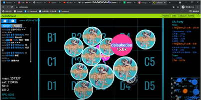

<html>
    <hesd>
        <mata charset="utf-8"></mata>
        <title>AGAR.io江西</title>
        <link href="練習.css" rel="stylesheet" type="text/css">
    </hesd>
    <body>
        
        <h1>網址</h1>
        <ul>
        <li>youtube連結:<a href="https://www.youtube.com/channel/UCUL3ftFNvPovS-f18SdFhEg">江西</a></li>
        <li>FB連結:<a href="https://www.facebook.com/profile.php?id=100068670226171">江西</a></li>
        </ul>
    </body>
</html>
